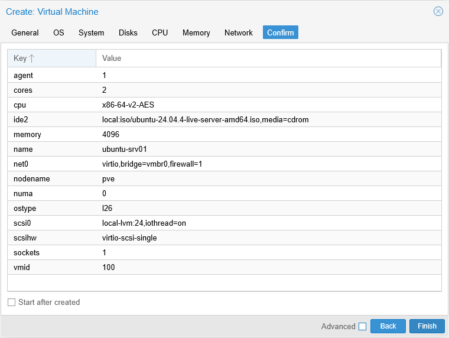
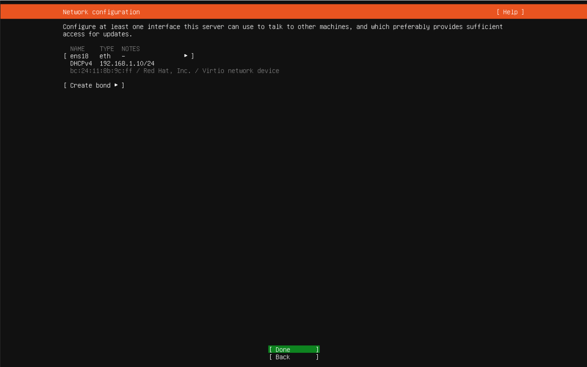
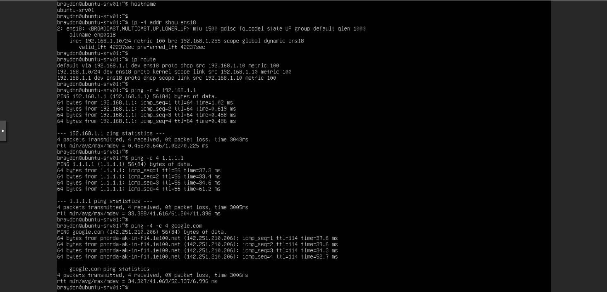
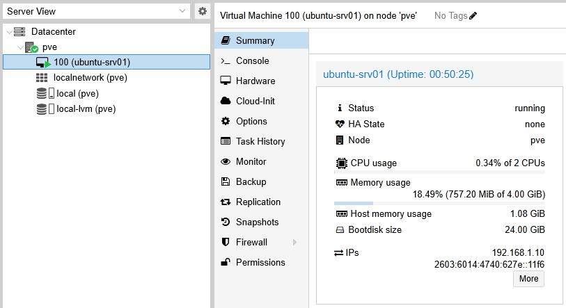

# Project 02 — Proxmox Virtualization

## Overview

This project demonstrates the deployment and configuration of an Ubuntu Server virtual machine using Proxmox VE.

The goal of this project was to gain hands-on experience with virtualization, virtual machine resource allocation, virtual networking, Linux server installation, and basic network verification.

The VM created during this project will also serve as a Linux system for future homelab projects and services.

---

## Environment

### Proxmox Host

- Platform: Proxmox VE 9.2.2
- Hostname: `pve`
- Physical server: Dell OptiPlex 5070 Micro
- Processor: Intel Core i5-9500T
- Memory: 24 GB RAM

### Virtual Machine

- VM ID: `100`
- Hostname: `ubuntu-srv01`
- Operating System: Ubuntu Server 24.04.4 LTS
- vCPUs: 2
- Memory: 4 GB
- Virtual Disk: 24 GB
- Network Adapter: VirtIO
- Proxmox Bridge: `vmbr0`
- QEMU Guest Agent: Installed and running

---

## Virtual Machine Creation

A new virtual machine was created in Proxmox and configured with dedicated virtual CPU, memory, storage, and networking resources.

The Ubuntu Server installation ISO was attached as virtual installation media.

The VM was connected to the Proxmox Linux bridge `vmbr0` using a VirtIO virtual network adapter. This allows the VM to communicate with the physical LAN through the Proxmox host's network connection.

### VM Configuration



---

## Ubuntu Server Installation

Ubuntu Server 24.04.4 LTS was installed on the virtual machine.

During installation, the VirtIO network interface was detected as `ens18` and automatically received an IPv4 address using DHCP.

The installer showed:

- Interface: `ens18`
- IPv4 address: `192.168.1.10/24`
- Address assignment: DHCP

This confirmed that the VM's virtual network adapter and Proxmox bridge were successfully providing access to the physical network.

### Installer Network Configuration



---

## Network Verification

After installation, the VM's network configuration and connectivity were verified from the Ubuntu command line.

### Hostname Verification

```bash
hostname
```

Confirmed the system hostname:

```text
ubuntu-srv01
```

### IPv4 Address Verification

```bash
ip -4 addr show ens18
```

Confirmed:

```text
192.168.1.10/24
```

### Routing Table Verification

```bash
ip route
```

The routing table showed a default route through:

```text
192.168.1.1
```

This means traffic destined for networks outside the local subnet is forwarded to the LAN's default gateway.

### Default Gateway Connectivity

```bash
ping -c 4 192.168.1.1
```

Result:

```text
0% packet loss
```

This verified Layer 3 connectivity between the Ubuntu VM and the local default gateway.

### Internet Connectivity

```bash
ping -c 4 1.1.1.1
```

Result:

```text
0% packet loss
```

This verified IPv4 connectivity beyond the local network.

### DNS and IPv4 Connectivity

```bash
ping -4 -c 4 google.com
```

Result:

```text
0% packet loss
```

This verified that DNS resolution was functioning and that the VM could reach an Internet host using IPv4.

### Network Verification Evidence



---

## QEMU Guest Agent

The QEMU Guest Agent was installed inside the Ubuntu VM and enabled as a system service.

The service was verified using:

```bash
systemctl status qemu-guest-agent
```

The service reported:

```text
active (running)
```

The QEMU Guest Agent improves communication between Proxmox and the guest operating system and allows Proxmox to retrieve information directly from the VM.

After installation, Proxmox successfully displayed the VM's IPv4 address directly in the VM summary.

---

## Proxmox VM Verification

The Proxmox VM summary confirmed that `ubuntu-srv01` was running successfully and that Proxmox could retrieve guest information.

The summary displayed:

- VM status: Running
- 2 virtual CPUs
- 4 GB allocated memory
- 24 GB virtual disk
- IPv4 address: `192.168.1.10`
- Guest information available through the QEMU Guest Agent

### Proxmox VM Summary



---

## Skills Practiced

This project provided hands-on experience with:

- Type-1 hypervisor virtualization
- Virtual machine provisioning
- Virtual CPU and memory allocation
- Virtual disk provisioning
- Linux server installation
- Proxmox Linux bridges
- VirtIO virtual networking
- DHCP address assignment
- Linux network interface identification
- IPv4 addressing and subnet masks
- Default gateways and routing tables
- ICMP connectivity testing
- DNS resolution testing
- Linux command-line administration
- Linux systemd service verification
- QEMU Guest Agent integration
- Basic network troubleshooting

---

## Key Takeaways

This project demonstrated how a virtual machine can function as an independent system while using virtualized hardware provided by a hypervisor.

The Ubuntu VM's `ens18` interface is a virtual network interface rather than a physical Ethernet adapter. Proxmox connects this interface to the `vmbr0` Linux bridge, which provides a path from the VM to the physical network.

Network verification was performed in stages:

1. Verify the VM's IPv4 address and subnet.
2. Verify the routing table and default gateway.
3. Ping the default gateway to test local network connectivity.
4. Ping a public IPv4 address to test Internet connectivity independently of DNS.
5. Ping a domain name to verify DNS resolution and Internet connectivity together.

Testing connectivity in this order helps isolate where a networking problem exists instead of relying on a single connectivity test.

---

## Next Steps

Future work will build on this VM by using it for additional Linux administration and network services while continuing to document configuration, verification, and troubleshooting procedures.
