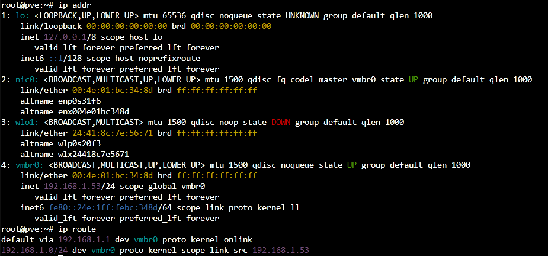
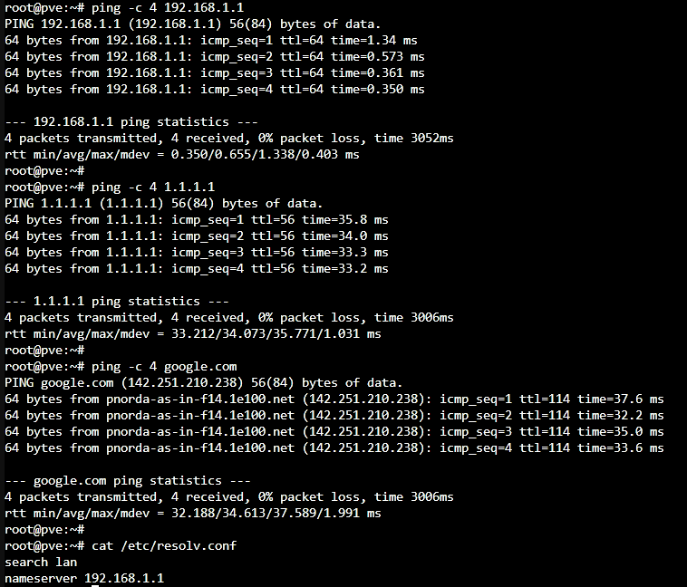
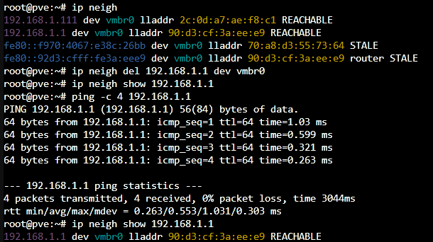
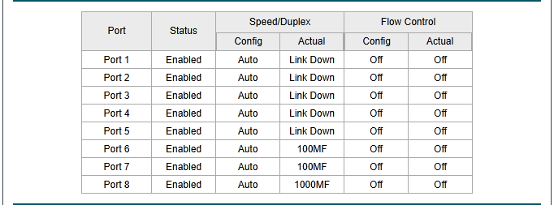
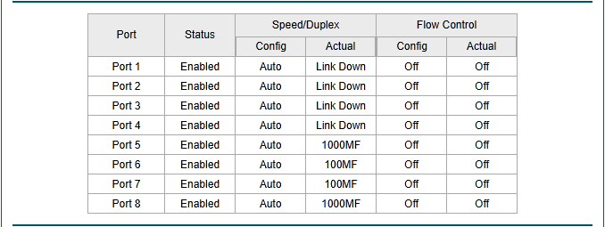

# Project 04 — Managed Switch Configuration

## Objective

Use the TP-Link managed switch to practice Layer 2 networking concepts and build a documented switch configuration.

## Planned Topics

* Port status and speed
* MAC address learning
* Access ports
* VLAN membership
* Tagged vs untagged traffic
* 802.1Q trunks
* Port isolation where supported
* Spanning Tree concepts where supported
* Link aggregation concepts where supported
* Configuration backup

## Verification

* Verify MAC address table behavior.
* Move a host between ports and observe learning.
* Create VLANs and verify isolation.
* Configure a tagged link and verify VLAN traffic.
* Capture screenshots and explain the result in my own words.

## Lab Session — 2026-08-23

### Objective

Inspect and troubleshoot the physical homelab LAN using the Proxmox host and TP-Link TL-SG108E managed switch. The goal was to verify Layer 2 and Layer 3 connectivity, practice a structured troubleshooting process, and relate the results to real-world LAN support tasks.

### Environment

* Dell OptiPlex 5070 Micro running Proxmox VE
* TP-Link TL-SG108E managed switch
* Spectrum router
* LAN: `192.168.1.0/24`
* Proxmox management IP: `192.168.1.53`
* Switch management IP: `192.168.1.9`
* Default gateway: `192.168.1.1`

### Network Interface Verification

Used `ip addr` on the Proxmox host to inspect its network interfaces.

The physical Ethernet interface `nic0` was UP and connected to the Proxmox Linux bridge `vmbr0`. The management address `192.168.1.53/24` was assigned to `vmbr0`.

This demonstrated how Proxmox uses a Linux bridge to connect the physical network interface and virtualized workloads to the physical LAN.

#### Evidence — Proxmox Network Configuration



*Proxmox network configuration showing the physical NIC, `vmbr0` Linux bridge, `192.168.1.53/24` management address, and default route through `192.168.1.1`.*

### Routing Verification

Used `ip route` to inspect the host routing table.

Verified:

* `192.168.1.0/24` is directly connected through `vmbr0`.
* `192.168.1.1` is configured as the default gateway.
* Traffic destined outside the local subnet is forwarded toward the default gateway.

### Connectivity and DNS Troubleshooting

Connectivity was tested progressively to isolate different parts of the network path.

Commands used:

```bash
ping -c 4 192.168.1.1
ping -c 4 1.1.1.1
ping -c 4 google.com
cat /etc/resolv.conf
```

Results:

* Successfully reached `192.168.1.1`, verifying local connectivity to the default gateway.
* Successfully reached `1.1.1.1`, verifying external IP connectivity.
* Successfully resolved and reached `google.com`, verifying DNS resolution.
* Verified that the host was configured to use `192.168.1.1` as its DNS resolver.

This demonstrated a layered troubleshooting approach: verify local connectivity first, then upstream IP connectivity, and finally DNS resolution.

#### Evidence — Layered Connectivity Testing



*Successful testing of the local default gateway, external IP connectivity, and DNS name resolution.*

### ARP and Neighbor Discovery

Used `ip neigh` to inspect the Linux neighbor table and identify the MAC address associated with the default gateway.

The cached neighbor entry for `192.168.1.1` was manually removed:

```bash
ip neigh del 192.168.1.1 dev vmbr0
```

The neighbor table was checked to confirm that the cached entry had been removed.

A new ping was then sent to the default gateway:

```bash
ping -c 1 192.168.1.1
```

After communication with the gateway resumed, the neighbor table was checked again. The Proxmox host automatically relearned the gateway's MAC address and repopulated the neighbor entry.

This demonstrated how ARP is used to resolve a local IPv4 address to the MAC address required for Layer 2 Ethernet communication.

The exercise also reinforced that when traffic is destined for a device outside the local subnet, the host does not ARP for the remote destination's MAC address. Instead, it forwards the Ethernet frame to the MAC address of its default gateway while the IP packet remains addressed to the remote destination.

#### Evidence — ARP Neighbor Relearning



*The gateway neighbor entry was removed, communication was reinitiated, and the Proxmox host relearned the gateway's MAC address through ARP.*

### Managed Switch Administration

Accessed the TP-Link TL-SG108E web management interface at `192.168.1.9`.

The switch was configured with:

* Management IP: `192.168.1.9`
* Subnet mask: `255.255.255.0`
* Default gateway: `192.168.1.1`

The factory-default administrative credentials were replaced with a new password as a basic security-hardening measure. No credentials are stored in this repository.

The switch's port status was then inspected to identify active links and their negotiated speeds.

Four ports were observed with active links:

* Port 5 — 1000 Mbps
* Port 6 — 100 Mbps
* Port 7 — 100 Mbps
* Port 8 — 1000 Mbps

Ports 1 through 4 were enabled but had no active physical link.

This demonstrated the difference between a switch port being administratively enabled and the port having an active physical connection.

### Physical Switch Port Identification

The physical switch port connected to the Proxmox server was identified without manually tracing the Ethernet cable.

With the server connected, Port 5 showed an active 1000 Mbps link.

The Ethernet cable was temporarily disconnected from the Proxmox server. After refreshing the managed switch interface, Port 5 changed from `1000M` to `Link Down`.

The Ethernet cable was then reconnected to the server. Port 5 returned to an active `1000M` link.

This confirmed:

* Proxmox host → TP-Link Port 5
* Physical link successfully restored after reconnection
* Negotiated link speed → 1 Gbps
* Ethernet auto-negotiation successfully restored the link

This exercise demonstrated how physical link-state information on a managed switch can be used to identify and troubleshoot endpoint connections.

#### Evidence — Physical Link-State Troubleshooting

**Server disconnected:**



*Port 5 transitioned to `Link Down` when the Proxmox server's Ethernet connection was disconnected.*

**Server reconnected:**



*Port 5 returned at `1000M` after reconnecting the server, confirming the Proxmox host's physical switch port and negotiated link speed.*

### Troubleshooting Methodology

The lab followed a structured troubleshooting process rather than changing network settings without first isolating the problem.

The troubleshooting path used was:

1. Verify the network interface and IP configuration.
2. Verify the local routing table and default gateway.
3. Test connectivity to the local gateway.
4. Test connectivity to an external IP address.
5. Test DNS name resolution.
6. Inspect ARP/neighbor information.
7. Inspect managed switch port status.
8. Correlate physical link-state changes with the connected endpoint.

This approach helps determine whether a connectivity problem exists at the endpoint, local LAN, default gateway, upstream network, or DNS layer.

### Skills Practiced

* IPv4 addressing and subnetting
* Default gateway concepts
* Linux routing table inspection
* Linux network interface inspection
* ICMP connectivity testing
* Structured LAN troubleshooting
* DNS resolution and troubleshooting
* ARP and neighbor-table inspection
* IPv4-to-MAC address resolution
* Layer 2 vs. Layer 3 communication
* Ethernet frame forwarding concepts
* Proxmox Linux bridge networking
* Managed switch administration
* Switch port status monitoring
* Physical link-state troubleshooting
* Ethernet speed and duplex auto-negotiation
* Basic network-device security hardening

### Key Takeaways

This lab connected several networking concepts into a single troubleshooting workflow.

The Proxmox host uses `192.168.1.53/24` on the `vmbr0` Linux bridge and forwards traffic destined outside the local subnet to the default gateway at `192.168.1.1`.

Successful testing of the gateway, an external IP address, and a DNS hostname demonstrated how connectivity can be tested progressively to isolate different types of network failures.

The ARP exercise demonstrated how a host discovers the MAC address associated with another IPv4 device on the local network. It also demonstrated why traffic destined outside the local subnet is sent to the default gateway's MAC address rather than the MAC address of the remote destination.

Finally, managed-switch link-state monitoring was used to identify the Proxmox host on physical Port 5 and verify a negotiated 1 Gbps Ethernet connection.

These exercises provided hands-on practice with troubleshooting methods applicable to LAN support, network support, and junior network administration roles.


